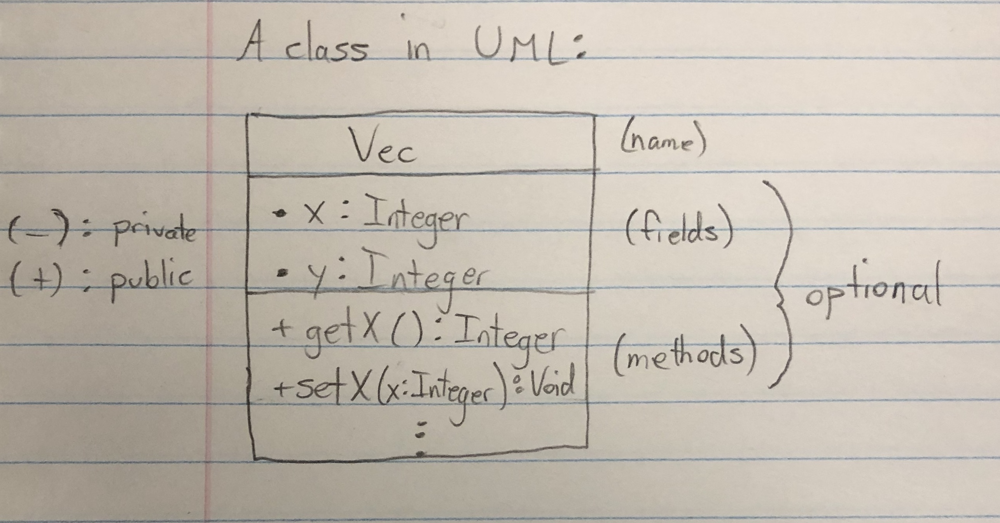
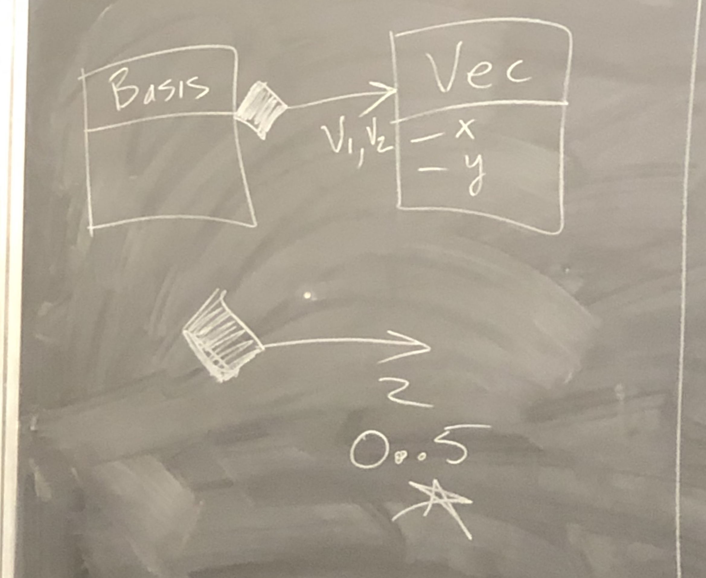
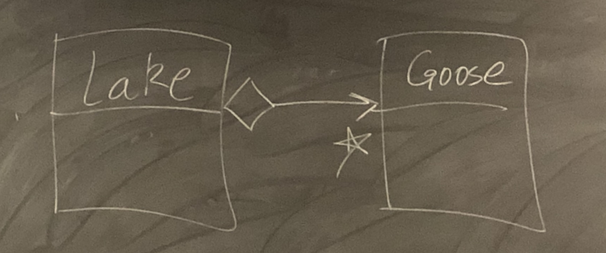
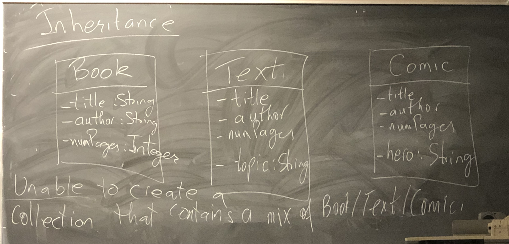
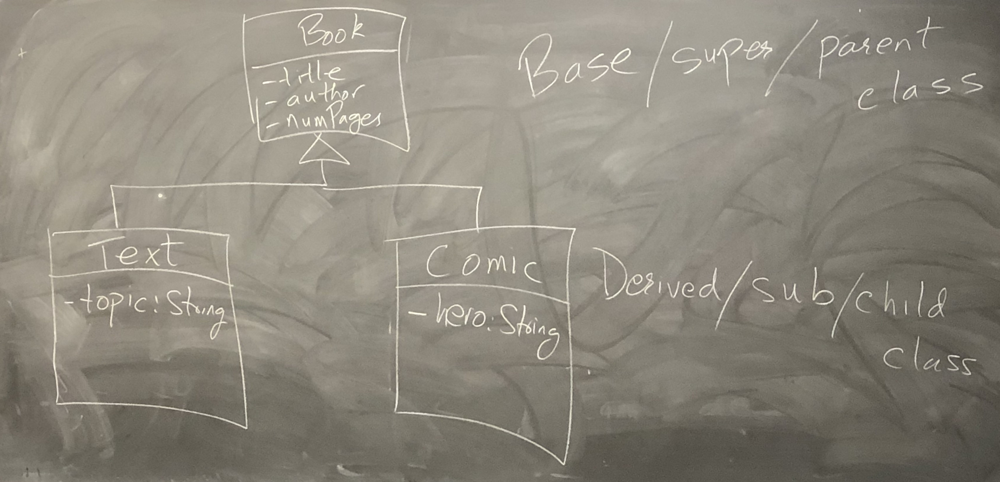

# Lecture 16

## Accessors/Mutators, System Modelling + Relationships

### Last time

Keep fields private!

Provide aggressors (getters) and/or mutators (setters) which are public. 

```cpp
class Vec {
  int x,y;
  public:
  int getX() const {return x;}
  int getY() const {return y;}
  void setX(int n) {x = n;}
  void setY(int n) {y = n;}
};
```

Suppose a class has private fields and no aggressors/mutators.

- Want to implement the I/O operators
  - as standalone functions

```cpp
class Vec {
	int x,y;
  friend std::ostream & operator<<(std::ostream &, const Vec &);
};
```


## System Modelling

- Identify the abstractions/entities/classes
- Interaction/relationship between classes

### UML - Unified Modelling Language 

- Scratching the surface 



- Whenever possible use general types not specific to a language

### Composition

```cpp
class Vec {
	int x,y;
	public:
	Vec(int, int);
};
```

```cpp
class Basis {
	Vec v1,v2;
};

Basis b; // won't compile as cannot default construct v1,v2
```

#### Solution

1. Provide default constructor for `Vec`.
2. Use the MIL to call on alternate constructor

```cpp
Basis::Basis() : v1{0,1}, v2{1,0} {}
Basis b; // Valid; never default constructs v1,v2
```

- Embedding an object within another is composition.
- When an object takes ownership of another object.

Composition creates an OWNS-A relation

- Basis OWNS-A Vec

Typically, A OWNS-A B, if:

- When A is copied, B is copied
- When A is destroyed, B is destroyed

```cpp
// List OWNS-A Node
class List {
	...;
  Node * theList : ... {}
};
```

```cpp
// Car OWNS-A Wheels
class Car {
	Wheel w1,w2,w3,w4;
};

// Is it still OWNS-A?
class Car {
  wheel *w1, *w2, *w3, *w4;
};
```




### Aggregation

Parts in a Catalogue: Catalogue HAS-A Car-Part

Typically, A HAS-A B, if:

- When A is copied, B is not
- When A is destroyed, B is not



```cpp
class Lake {
	Goose **geese;
};
```


### Inheritance

### 

Unable to create a collection that contains a mix of Book/Text/Comic.

Observation:

- Text IS_A Book (with an extra topic field)
- Comic IS_A Book (with an extra hero field)



Derived class inherits ALL (public & private) members (fields as methods) from the Base class. 

Any method you can call on a Book object, you can call on a Text object.

- ifstream IS_A istream

Text inherits private fields: title, author, numPages

- Yet Text objects cannot access these fields.

```cpp
Text::Text(string t, string a, int n, string topic) :
	title{t}, author{a}, numPages{n}, topic{topic} {}
```

Won't compile:

1. Inherited fields are also private.
2. MIL can only refer to fields declared in the class.
3. No default constructor for Book.