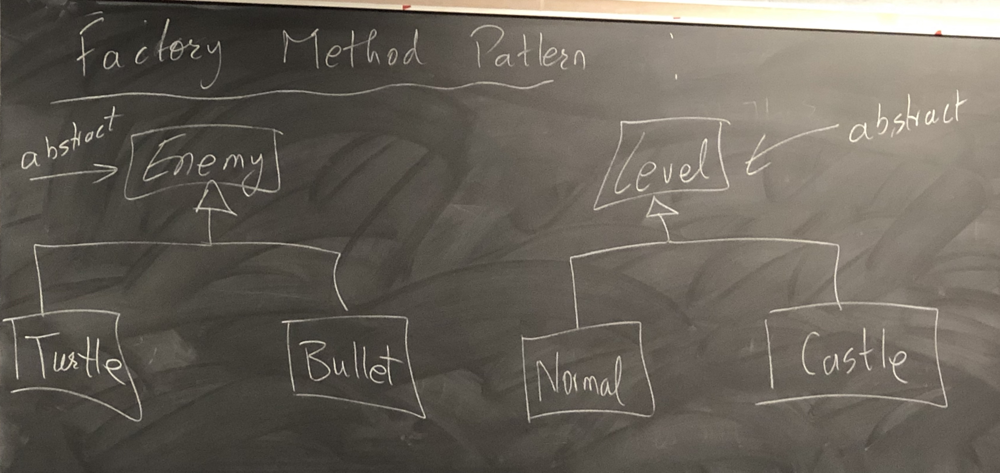
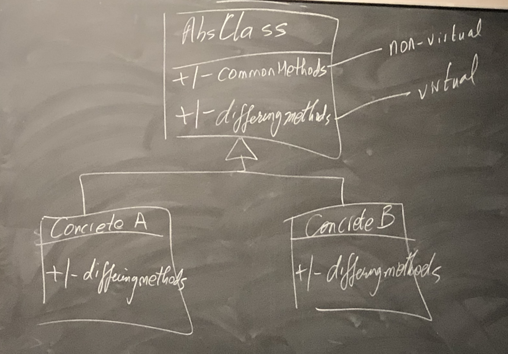
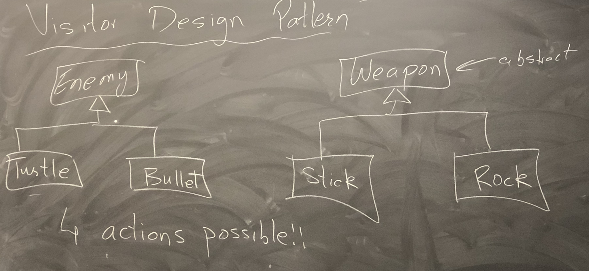

# Lecture 20

## Object Oriented Design Philosophy

- Use abstract base classes to provide an interface
- Use pointers to base class that call those interface methods
- Behaviour changes based on the runtime of objects

### Iterator Pattern

- `operator *`, `operator++`, `operator!=`

  ```cpp
  class AbsIter{
  	public:
    virtual int &operator*() const = 0;
    virtual AbsIter &operator++() = 0;
    virtual bool operator!=(const AbsIter &) const = 0;
    virtual ~AbsIter() {}
  };
  
  class List {
    ...
  	public:
  	class Iterator : public AbsIter {
      ...
    };
    ... // List::Iterator IS-A AbsIter
  };
  
  class Set {
    ...
    public:
    class Iterator : public AbsIter {
      ...
    };
    ... // Set::Iterator IS-A AbsIter
  };
  ```

  We can now implement code that operates using `AbsIter` and not being tied to a specific data structure.

  ```cpp
  template <typename Fn>
  void foreach(AbsIter & start, const AbsIter & end, Fn f) {
  	while(start != end) {
  		f(*start);
  		++start;
  	}
  }
  
  // Example
  void addTen(int &n) {
  	n = n + 10;
  }
  
  List * l: ...
  ...
  List::Iterator i = l.begin();
  foreach(i, l.end(), addTen);
  ```

  

### Factory Method Pattern



```cpp
Player * p = ...;
Level * l = ...;
Enemy * e = ...;
  
while (p->notDead()) {
	// generate enemy should depend on Level
  e = l->createEnemy();
	// attack player
}

class Level {
  public:
  virtual Enemy * createEnemy() = 0;
};

class Normal : public Level {
  public:
  Enemy * createEnemy() override { /* more turtles */}
};

class castle : public Level {
  public:
  Enemy * createEnemy() override { /* more bullets */ }
};
```

The factory method pattern is also called the "virtual constructor" pattern.

- `List::addToFront`
- `List::begin` / `List::end`

### Template Method Pattern

- Base class implements the template/skeleton and the subclass fills the blanks.
- Base class allows overriding of some virtual methods, but other methods must remain unchanged (non-virtual).



```cpp
class Turtle {
  ...
  void drawHead() {...}
  void drawFeet() {...}
  virtual void drawShell() = 0;
  
	public:
	void draw() {
		drawHead();
    drawShell();
    drawFeet();
	}
};

class RedTurtle : public Turtle {
  void drawShell() override {...}
};

class GreenTurtle : public Turtle {
  void drawShell() override {...}
};

Turtle *t = ...;
t->draw();
```

### Non-Virtual Interface (NVI) Idiom

#### Public Virtual Method

- Public(interface) - provide a contract
- Virtual - invitation to subclasses to change behaviour
- ==Contradictory!==

#### In a NVI

- all public methods are non-virtual (except destructor)
- all virtual methods are private/protected

```cpp
// Not using NVI
class Media {
	public:
	virtual void play() = 0;
};

// With NVI
class Media {
  virtual void doPlay() = 0;
  
  public:
  void play() { // CopyrightCheck();
    doPlay();
  }
};
```

### Visitor Design Pattern



```cpp
class Enemy {
	...
	virtual void strike(Stick &) = 0;
	virtual void strike(Rock &) = 0;
};

Enemy *e = l->createEnemy();
Weapon *w = p->chooseWeapon();
e->strike(*w); // Won't compile
```

In C++, dynamic dispatch does not account for runtime type of parameter.

```cpp
class Enemy {
	public:
	virtual void strike(Weapon &) = 0;
};

class Turtle : public Enemy {
	public:
	void strike(weapon & w) override { w.useOn(*this); } // Turtle
};

class Bullet : public Enemy {
	public:
	void strike(weapon & w) override { w.useOn(*this); } // Bullet
};

class Weapon {
  virtual void useOn(Turtle &) = 0;
  virtual void useOn(Weapon &) = 0;
};
```

### Double Dispatch

- using a combination of overriding and overloading