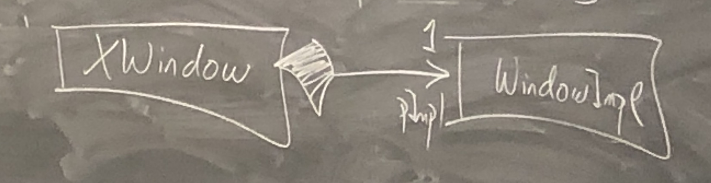
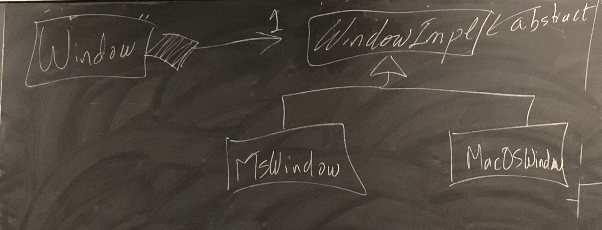

# Lecture 21

## Compilation Dependencies

### Last Time: Visitor Design Pattern (VDP)

- In C++, dynamic dispatch does not consider the runtime type of paramters
- **Double Dispatch:** combination of overriding and overloading 


### Book Hierarchy

- Want to add functionality that depends on runtime type of objects
- What if we don't have the source code?
- What if the behaviour does not really belong to the classes?
- We can do this if the Book hierarchy will "accept" BookVisitors

```cpp
class Book { // Enemy
  public:
  virtual void accept(BookVisitor &v) { // strike(weapon)
    v.visit(*this); // useOn
  }
};

Class Text : public Book {
  public:
  void accept(BookVisitor &v) override { v.visit(*this); }
};

Class Comic : public Book {
  public:
  void accept(BookVisitor &v) override { v.visit(*this); } // this: Comic
};

class BookVisitor {
  public:
  virtual void visit(Book &) = 0;
  virtual void visit(Comic &) = 0;
  virtual void visit(Text &) = 0;
  ~BookVisitor();
};
```

#### Cataloging Books

- author -> # of Books
- topic -> # of Texts
- hero -> # of Comics
- string -> int


### STL -> `std::map`

Template class, generalizes arrays

- Parameterized on 2 types -> Key/Value

- Key Type must support `operator<`

- ```cpp
  std::map<string, int> m;
  m["abc"] = 5;
  m["def"] = 2;
  m.erase("abc");
  m.count("abc");
  
  for (auto p : m) { // std::pair<string, int>
    cout << p.first << p.second;
  } // Iteration is in sorted key order
  ```

```cpp
Class Catalog : public BookVisitor {
	map<string, int> cat;
  public:
  void visit(Book &b) override { ++cat[bgetAuthor()]; }
  void visit(Comic &c) override { ++cat[c.getHero()]; }
};
```

- `se/visitor`: 
  - cycle of includes
- `se/visitor2`:
  - Fix by forward declaring classes


### Compilation Dependencies

- an include creates a dependency
- Best to reduce dependencies
  - Avoid cycles
  - Fewer recompilations
  - Faster compile time

**Advice:** *whenever possible*, forward declare a class

```cpp
class XYZ; // Hey compiler, this type will exist

// File "a.h"
class A {...};
```

```cpp
// File "b.h"
#include "a.h"
class B : public A {
	...
};
```

```cpp
// File "c.h"
#include "a.h"
class C {
  A a;
};
```

To construct C, you will need to know its size, and therefore need the size of A

```cpp
// File "d.h"
class A;
class D {
  A *pA;
};
```

```cpp
// File "d.cc"
#include "a.h"
pA->method();
```

```cpp
// File "e.h"
class A;
class E {
	A foo(A a);
};
```

```cpp
// File "e.cc"
#include "e.h"
#include "a.h"
A E::foo(A a) {}
```


### Reducing Dependencies

```cpp
// File "window.h"
#include <Xlib/Xlib.h>
class XWindow {
  Display *d;
  Window w;
  GC gc;
  public:
  drawRect();
  ...;
};
```

```cpp
// File "client.cc"
#include "window.h"
```

`client.cc` needs to recompile even if a private member in `window.h` changes

**Strategy: pImpl Idiom (pointer to Implementation)****

```cpp
// File "windowimpl.h"
#include <Xlib/Xlib.h>
struct WindowImpl {
  Display *d;
  Window w;
  GC gc;
};
```

```cpp
// File "window.h"
struct WindowImpl;
class XWindow {
	WindowImpl *pImpl;
	public:
	...
};
```

```cpp
// File "window.cc"
#include "window.h"
#include "windowimpl.h"
XWindow() : pImpl { new WindowImpl } {}
~XWindow() { delete pImpl; }
```






### Bridge Design Pattern

Extended the pImpl idiom to accomodate multiple implementation styles. 


