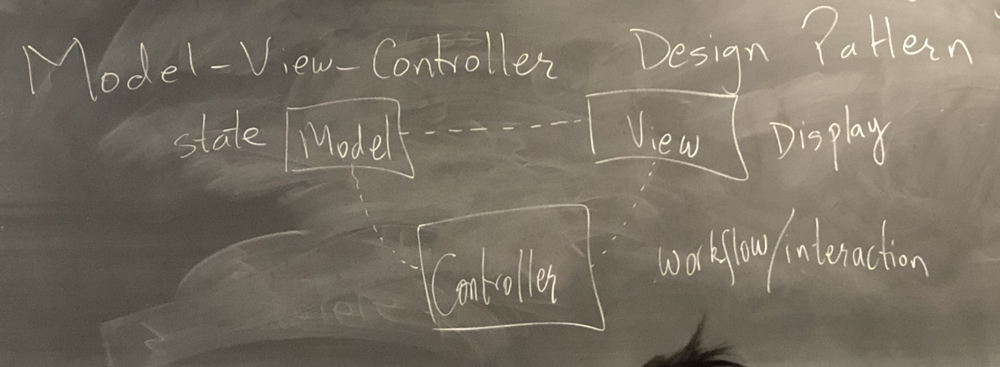

# Lecture 22

## MVC Design Pattern, Course Evals, Exception Safety (smart pointers)

### Coupling & Cohesion

- **Coupling:** the interaction/dependency between modules
  - Aim -> low coupling
- **Cohesion:** how related are things within a module
  - Aim -> high cohesion


### Decouple the Interface

- Primary program classes should not interact with the user - no I/O
- Single Responsibility Principle:
  - a class should be responsible for one task
  - a class should only have one reason to change


### Model-View-Controller Design Pattern




### Exception Safety

```cpp
void f() {
	MyClass *p = new MyClass;
  MyClass mc;
  g(); // If g throws, f leaks memory
  delete p;
}
```

Even if exceptions occur, our code should:

- not leak memory
- not have dangling pointers
- not break class invariants
- continue to be in a "valid" state

```cpp
void f() {
	MyClass *p = new MyClass;
	try {
		MyClass mc; // error-prone
		g(); // tedious
	} catch(...) {
		delete p;
		throw;
	} 
	delete p;
}
```

#### C++ Guarantee

- During stack unwinding, destructors for stack allocated data are called.
- Maximize stack usage

#### RAII: Resource Acquisition Is Initialization

- wrap resources in stack objects whose destructor frees the resource

- ```cpp
  ifstream f{"file.txt"};
  // file f will be closed irrespective of whether
  // an exception occurs or not.
  ```

- RAII with heap memory

  - wrap heap memory within a stack object
  - have the stack object's destructor delete the heap memory

Standard Library's template class `uniqueptr<T>`

- constructor takes a `T*` (pointer to heap memory)

- destructor calls delete on the provided pointer

- ```cpp
  void f() {
  	std::unique_ptr<MyClass> p{new MyClass};
  	auto p = std::make_unique<MyClass>(); // Use for project
  	MyClass mc;
  	g();
  }
  ```

  ```cpp
  unique_ptr<MyClass> p = make_unique<MyClass>();
  unique_ptr<MyClass> q {p}; // Calls copy constructor and Won't Compile
  ```

- Copy constructor/assignment operator are disabled to avoid double free error. However, move constructor/assignment operator is enabled. 

- `shared_ptr<T>` uses reference counting to keep track of how many owners share this heap object

- destructor is smart

  - decreases reference count
  - deletes heap object when reference count goes to 0