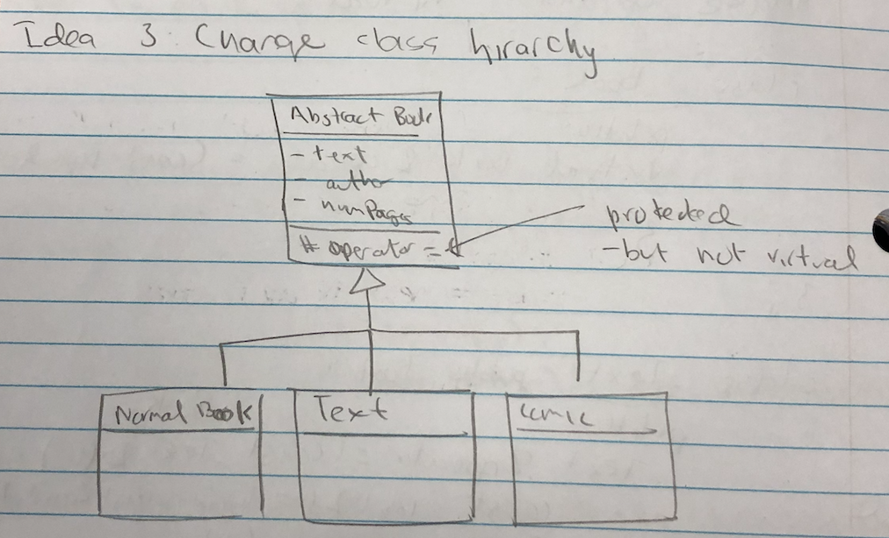

# Lecture 24

## Dynamic Casting, Partial/mixed assignment, Big 5 Revisited

### Dynamic Casting

```c++
vector<Book *> myBooks;
for (...) {
  Text *t = dynamic_cast<Text *>(myBook[i]);
  // If myBook[i] IS-A Textbook, then this will be fine.
  // Else dynamic_cast will make it a nullptr
  if (t != nullptr) { // Check for nullptr
    t->getTopic();
  } else {
    cout << "Not Text";
  }
}
```

`dynamic_cast` allows us to determine the runtime type of an object.

Used to cast `shared_ptr` to `shared_ptr`.

- `const_pointer_cast`
- `static_pointer_cast`
- `dynamic_pointer_cast`

So casting with smart pointers only works with shared, not if done with unique (it causes issues)


### Runtime Type Information (RTTI)

```c++
void whatIsIt(shared_ptr<Book> b) {
  if (dynamic_pointer_cast<Text>(b)) {
    cout << "Text";
  } else if (dynamic_pointer_cast<Comic>(b)) {
    cout << "Comic";
  } else {
    cout << "Book";
  }
}
```

This code is coupled to the class hierarchy. Its better to just use `virtual`.

```c++
Comic c{...};
Book &b{c};
Comic &r = dynamic_cast<Comic &>(b);
cout << r.getHero();
```

If a `dynamic_cast` to a reference fails, a `bad_cast` exception is thrown.


### Big 5 Revisited

```c++
class Book {
public:
  // Big 5 implemented
};

class Text : public Book {
public:
  // Not implemented Big 5
};

Text copyA{a}; // User default
// First calls Book copy ctor
// Copies fields only in Text

Text::Text(const Text & other) : Book{other}, topic{other.topic} {}

Text & Text::operator=(const Text & other) {
  Book::operator=(other); // Order here is just convention.
  topic = other.topic;		// Could be copied in any order.
  return *this;
}

Text::Text(Text && other) : Book{std::move(other)}, topic{std::move(other.topic)} {}
// If std::move() is not used, then the copy constructor is being called.
// std::move() allows lvalues to be treated as rvalues.

Text & Text::operator=(Text && other) {
  Book::operator=(std::move(other));
  topic = std::move(other.topic);
  return *this;
}
```

```c++
Text a{"CS246", "Nomair", 150, "C++"};
Text b{"CS245", "Alice", 50, "logic"};

Book *pa{ &a };
Book *pb{ &b };

// Object assignment through base class pointers
*pa = *pb; // Calls Book::operator=() since it is not virtual

// pa -> "CS245" "Alice" 50 "C++"
// "C++" should not appear, so we have a partial assignment problem
```

```c++
// Partial Assignment Solution 1

// Make operator= virtual
class Book {
public:
  virtual Book & operator=(const Book & other) {...}
};

class Text{
public:
  Text & operator=(const Book & other) override { // Parameter should be Book to override
    // To avoid mixed assignment problem, we use dynamic casting
    // Throws `bad_cast` in case of mixed assignment
    const Text & t = dynamic_cast<Text &>(other); 
    Book::operator=(t);
    topic = t.getTopic();
    return *this;
  }
};
```


#### Partial Assignment Solution 2

Disallow object assignment through base class pointers

##### Idea 1: 

- Make `Book::operator=()` private
- Won't work since subclasses need access

##### Idea 2: 

- Make `Book::operator=()` protected
- But a `Book` can no longer be assigned to another `Book`

##### Idea 3: Change class hierarchy



```c++
AbstractBook &pa{&a};
AbstractBook &pb{&b};
*pa = *pb; // Won't compile since it is protected.
```


